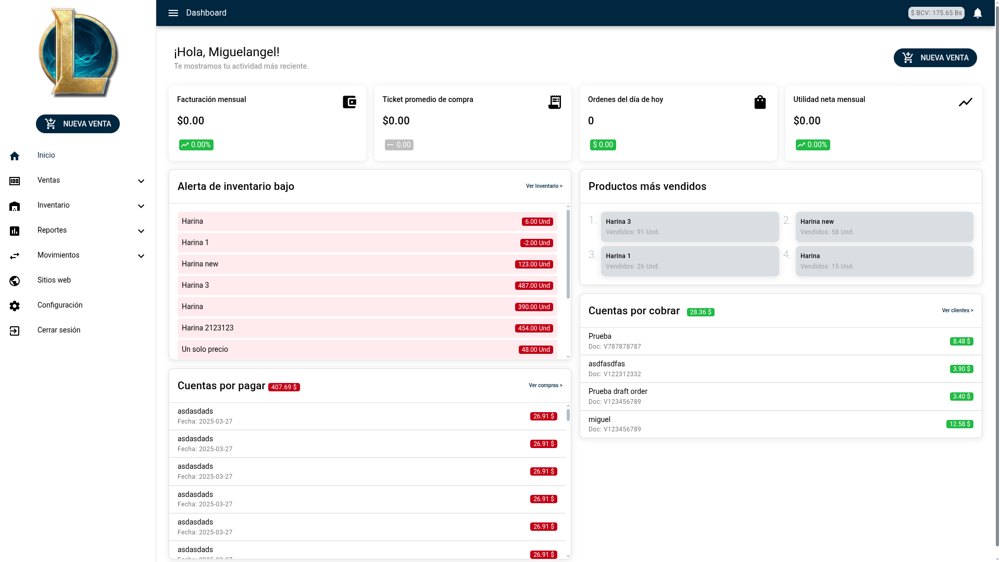
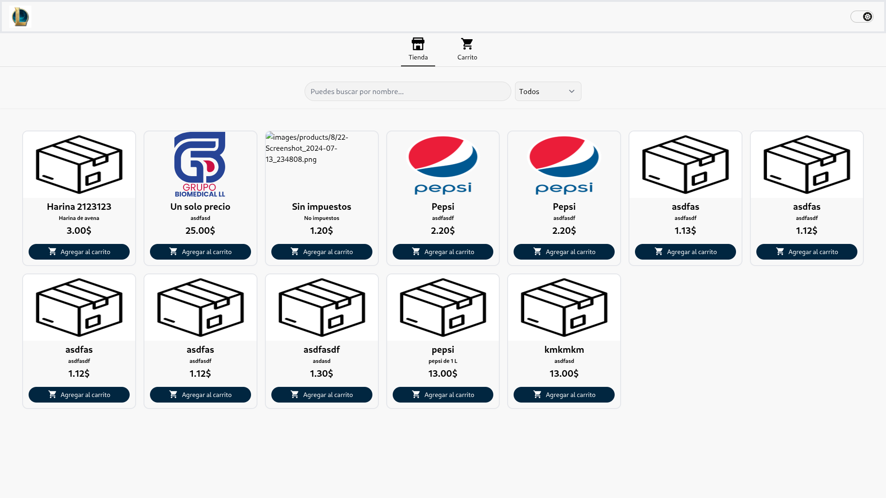

  
  
  
  
  
  
  
  
  
  
  
  
  
  
  
  
  
  
  
  
  
  
  
  

## 🚀 Featured Projects

### Massari Dev

An all-in-one business management software built with Vue, Quasar, and Pinia for state management. In this project, I developed the entire frontend and actively participated in the backend development.

---

### Karanta Dev

An informational website developed with SvelteKit to showcase the projects and services of the Karanta company.

---

### Dynamic E-commerce

This project automatically generates an e-commerce store for each new warehouse created in Massari. Upon request, it dynamically imports the corresponding styles and products, providing each user with a simple and functional online store.

